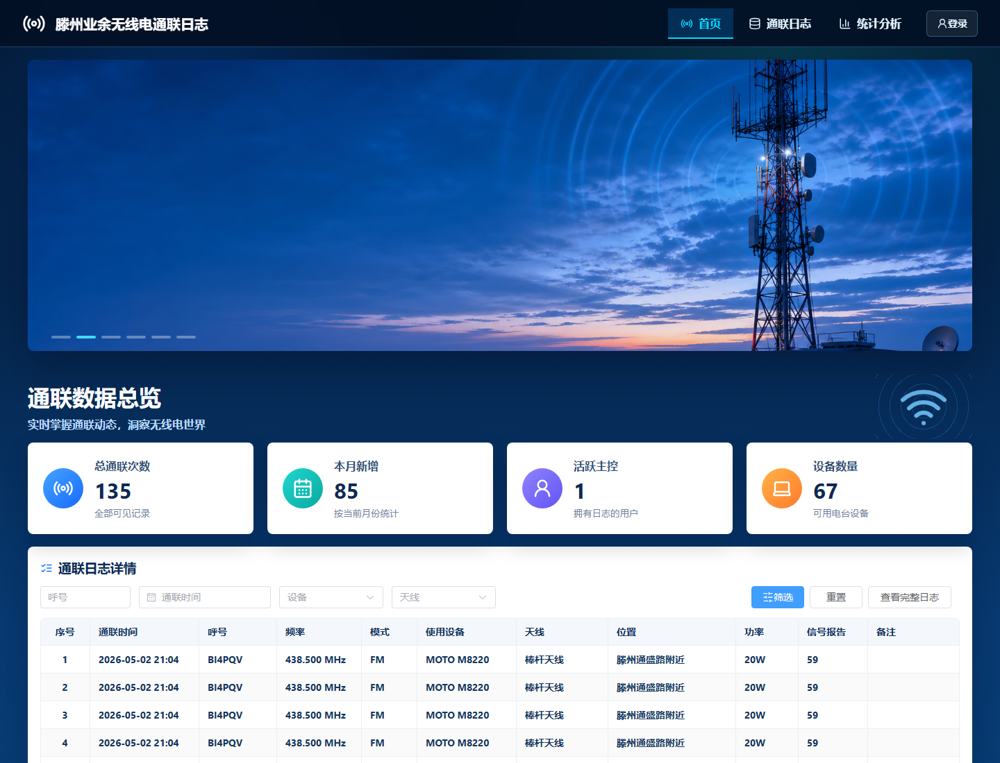
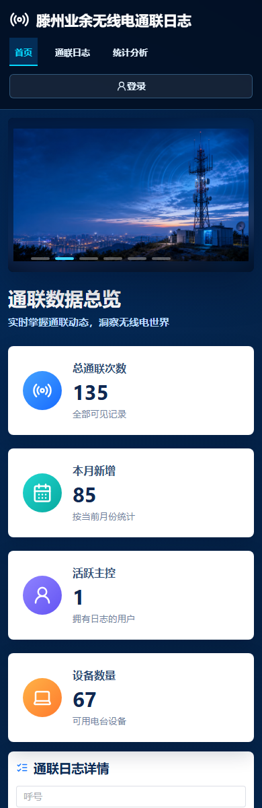

# Hamlog

Hamlog 是一个面向业余无线电通联记录管理的 Web 应用，适合用于个人台站、社团台站或中继台值守场景。项目包含 Vue 3 前端、Node.js REST API、SQLite 数据库、示例数据脚本和 Docker 部署配置。

滕州业余无线电中继台通联日志已经采用 Hamlog 系统，线上站点可访问：[https://www.cqchina.online](https://www.cqchina.online)。

## 作者

- 作者：Jimmy Chen
- 呼号：BA4JRF
- 邮箱：BA4JRF@gmail.com
- 博客：[https://www.biogeeker.com](https://www.biogeeker.com)

## 页面预览

桌面端数据总览：



移动端适配效果：



## 功能特性

- 通联数据总览：统计总通联数、本月新增、活跃操作员、设备数量等关键指标。
- 通联日志管理：支持分页、筛选、查看、编辑和批量删除通联记录。
- 数据导入：支持通过模板上传 `.xlsx`，也支持 CSV、ADIF 等格式的后端解析能力。
- 图表分析：按月份、频段、模式、呼号、操作员、设备和国家/地区展示通联分布。
- 用户与权限：内置管理员和操作员角色，管理员可维护用户与首页轮播图。
- 资料维护：支持个人资料、头像、密码修改。
- 本地持久化：使用 Node.js 内置 SQLite 能力保存数据。
- 容器部署：提供 `Dockerfile` 和 `docker-compose.yml`。

## 使用示例

Hamlog 可以用于这些场景：

- 中继台值守：公开展示通联概况、近期日志和统计分析，方便爱好者了解台站活跃情况。
- 社团台站管理：多名操作员共同维护日志，管理员统一管理账号、轮播图和基础展示内容。
- 活动通联记录：在应急通信演练、节日通联、比赛或公益活动后导入并整理通联数据。
- 个人电台归档：按呼号、频段、模式、设备、天线和日期筛选历史 QSO，沉淀长期通联资料。

典型流程：

1. 管理员创建操作员账号。
2. 操作员使用模板整理通联记录并上传。
3. 系统生成首页统计、排行榜、趋势图和日志列表。
4. 访客无需登录即可查看公开数据，登录用户可维护自己权限范围内的数据。

## 技术栈

- 前端：Vue 3、TypeScript、Vite、Element Plus、ECharts、Lucide Icons
- 后端：Node.js 24、原生 HTTP Server、Node SQLite、xlsx
- 工程化：npm workspaces、Docker、Docker Compose

## 环境要求

- Node.js 24 或更高版本
- npm
- 可选：Docker 与 Docker Compose

> 后端使用 `node:sqlite`，请确保本地 Node.js 版本支持该模块。

## 快速开始

```powershell
npm install
npm run seed
npm run dev
```

开发服务启动后访问：

- 前端页面：http://localhost:5173
- 后端 API：http://localhost:4174

## 示例账号

执行 `npm run seed` 后会初始化示例数据和账号：

| 角色 | 呼号 | 密码 |
| --- | --- | --- |
| 管理员 | `BA1ABC` | `admin123` |
| 操作员 | `BG5QSL` | `operator123` |

## 常用命令

```powershell
npm run dev          # 同时启动前端和后端开发服务
npm run dev:client   # 仅启动前端
npm run dev:server   # 仅启动后端
npm run seed         # 重置并写入示例数据
npm run test         # 运行服务端测试和前端类型检查
npm run build        # 构建前端生产产物
```

## Docker 部署

```powershell
docker compose up -d --build
```

默认会将容器内 `4174` 端口映射到宿主机 `8081`：

```text
http://localhost:8081
```

`docker-compose.yml` 已为数据库和上传文件配置数据卷：

- `hamlog-data`：SQLite 数据库
- `hamlog-uploads`：头像与轮播图等上传文件

## 项目结构

```text
hamlog/
├─ client/              # Vue 3 + Vite 前端
│  ├─ public/           # 静态资源与通联日志模板
│  └─ src/              # 前端源码
├─ docs/
│  └─ images/           # README 截图资源
├─ server/              # Node.js API 服务
│  ├─ src/              # 鉴权、数据库、查询和路由
│  ├─ test/             # API 测试
│  ├─ data/             # 本地 SQLite 数据库，已在 .gitignore 中忽略
│  └─ uploads/          # 用户上传文件，已在 .gitignore 中忽略
├─ scripts/             # 开发辅助脚本
├─ Dockerfile
├─ docker-compose.yml
└─ package.json
```

## 数据与开源注意事项

- `server/data/`、`server/uploads/`、`client/dist/`、日志文件和依赖目录不会提交到 Git。
- `package-lock.json` 建议提交，方便其他人复现依赖版本。
- 项目已采用 MIT License，开源前请确认示例图片、模板文件和项目名称符合你的发布计划。
- 当前示例账号只适合本地开发，正式部署后请及时修改密码。

## 许可

Copyright (c) 2026 Jimmy Chen

本项目基于 [MIT License](LICENSE) 开源。
